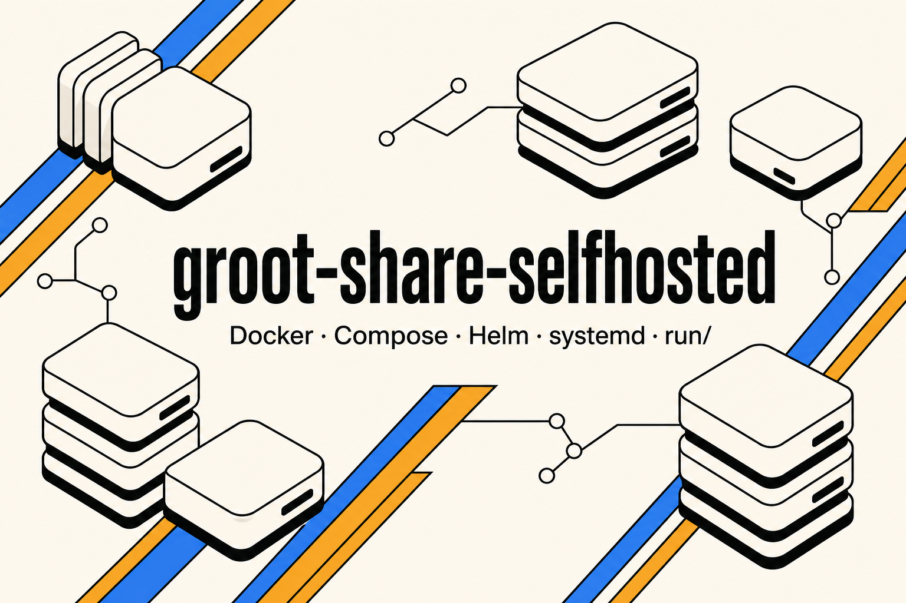

<a id="readme-top"></a>

# groot-share-selfhosted

[](./VERSION)
[](https://github.com/hrodrig/groot-share-selfhosted/releases)
[](./LICENSE)
[](https://github.com/hrodrig/groot-share/pkgs/container/gfs)
[](https://github.com/hrodrig/groot-share)
[](https://gghstats.hermesrodriguez.com/hrodrig/groot-share-selfhosted)

**Repo:** [github.com/hrodrig/groot-share-selfhosted](https://github.com/hrodrig/groot-share-selfhosted) · **Releases:** [GitHub Releases](https://github.com/hrodrig/groot-share-selfhosted/releases) · **App:** [groot-share](https://github.com/hrodrig/groot-share) (**gfs**) · **Spec:** [gfs SPECIFICATIONS](https://github.com/hrodrig/groot-share/blob/main/docs/SPECIFICATIONS.md) · **Alternatives:** [groot-share ALTERNATIVES](https://github.com/hrodrig/groot-share/blob/main/docs/ALTERNATIVES.md) · **Changelog:** [CHANGELOG.md](./CHANGELOG.md) · **Roadmap:** [ROADMAP.md](./ROADMAP.md) · **Disclaimer:** [DISCLAIMER.md](./DISCLAIMER.md)



## The problem

Teams on a **shared Kubernetes cluster** need **one catalog** of [groot](https://github.com/hrodrig/groot) diagnostic `.tar.gz` files — incidents, RCA, handoffs. Archives are often **several GB**. Producers: **laptops**, **bastion hosts** ([groot-selfhosted](https://github.com/hrodrig/groot-selfhosted)), **in-cluster** jobs ([groot-trigger](https://github.com/hrodrig/groot-trigger)).

The usual shortcuts fail (full write-up in **[groot-share](https://github.com/hrodrig/groot-share#the-problem)**):

- **Same S3-compatible key on every laptop** — revoke or leak hits the **whole** bucket.
- **“Just use Cyberduck”** — no per-user audit, retention, or upload API keyed to usernames.
- **“Run only groot-trigger”** — starts a collect; does **not** list, download, or retain archives.

**gfs** is the VPS door when you want login + API keys in front of those archives. **This repo** is the missing operator packaging: Compose, systemd, Helm — so you do not invent a second deploy dialect.

## How this repo solves it

**groot-share-selfhosted** owns **deployment and infra** for **[gfs](https://github.com/hrodrig/groot-share)**. Application source, binaries, and **`ghcr.io/hrodrig/gfs`** stay in **groot-share**.

| This repo ships | App behavior lives in |
|-----------------|------------------------|
| Compose **minimal** / **Traefik**, `docker run`, systemd, Helm chart **`gfs`** | Auth, ingest, Captures UI, audit, retention — [gfs SPEC](https://github.com/hrodrig/groot-share/blob/main/docs/SPECIFICATIONS.md) |
| **`GFS_HOST_DATA`** outside the clone (secrets + SQLite + local files) | Env contract `GFS_*` — [SPEC §5](https://github.com/hrodrig/groot-share/blob/main/docs/SPECIFICATIONS.md) |
| Topologies **`vps`** and **`vps-s3`** playbooks | Product freeze — [GFS-CONSENSUS](https://github.com/hrodrig/groot-share/blob/main/docs/GFS-CONSENSUS.md) |

**gfs is not universal.** Bucket only, no VPS → **S3 only** (groot `upload.s3` + S3 client) — **do not deploy gfs**. Decision matrix: **[groot-share ALTERNATIVES](https://github.com/hrodrig/groot-share/blob/main/docs/ALTERNATIVES.md)**.

### Alternatives (at a glance)

Product comparison, pros/cons, and “when not to use gfs” stay in **groot-share**. This table is the operator map only.

| Situation | Deploy here? | Details |
|-----------|--------------|---------|
| VPS, archives on disk, small team | **yes** — topology **`vps`** | [run/examples/vps](run/examples/vps/README.md) · [ALTERNATIVES — VPS only](https://github.com/hrodrig/groot-share/blob/main/docs/ALTERNATIVES.md#vps-only-gfs-on-disk) |
| Bucket + laptops without `AWS_*` + cluster multi-GB | **yes** — topology **`vps-s3`** | [run/examples/vps-s3](run/examples/vps-s3/README.md) · [ALTERNATIVES — VPS + S3](https://github.com/hrodrig/groot-share/blob/main/docs/ALTERNATIVES.md#vps--s3-gfs--bucket-home) |
| Bucket only, no VPS, operators use S3 tools | **no** | [groot-selfhosted s3-contabo](https://github.com/hrodrig/groot-selfhosted/tree/main/run/examples/s3-contabo) · [ALTERNATIVES — S3 only](https://github.com/hrodrig/groot-share/blob/main/docs/ALTERNATIVES.md#s3-only-groot-uploads3--s3-client-no-gfs) |
| Scheduled / bastion **collect** | **no** (groot packaging) | [groot-selfhosted](https://github.com/hrodrig/groot-selfhosted) → then HTTP to gfs or `upload.s3` |
| “Generate capture” button in cluster | **no** (trigger) | [groot-trigger](https://github.com/hrodrig/groot-trigger) + one storage row above |

→ **[Full comparison in groot-share `docs/ALTERNATIVES.md`](https://github.com/hrodrig/groot-share/blob/main/docs/ALTERNATIVES.md)**

> **Not a replacement for groot.** Collect / validate / analyze stay in the **groot** CLI. **groot-trigger** starts on-demand collects. **groot-selfhosted** ships CronJob / bastion playbooks. **This repo** ships VPS / `vps-s3` deploy playbooks for **gfs** only.

> **USE AT YOUR OWN RISK.** This is not a managed service. **You** are responsible for your data, secrets, backups, and how you run these stacks. Full text: **[DISCLAIMER.md](./DISCLAIMER.md)**.

**Related tools (same maintainer):**
- **[pgwd](https://github.com/hrodrig/pgwd)** — PostgreSQL connection watchdog ([live traffic](https://gghstats.hermesrodriguez.com/hrodrig/pgwd); deploy: [pgwd-selfhosted](https://github.com/hrodrig/pgwd-selfhosted))
- **[gghstats](https://github.com/hrodrig/gghstats)** — GitHub repo traffic beyond 14 days ([live demo](https://gghstats.hermesrodriguez.com); deploy: [gghstats-selfhosted](https://github.com/hrodrig/gghstats-selfhosted))
- **[kzero](https://github.com/hrodrig/kzero)** — bastion-first declarative workload reset ([live traffic](https://gghstats.hermesrodriguez.com/hrodrig/kzero); deploy: [kzero-selfhosted](https://github.com/hrodrig/kzero-selfhosted))
- **[groot](https://github.com/hrodrig/groot)** — Kubernetes diagnostics archive ([live traffic](https://gghstats.hermesrodriguez.com/hrodrig/groot); deploy: [groot-selfhosted](https://github.com/hrodrig/groot-selfhosted))

---

## Table of contents

- [The problem](#the-problem)
- [How this repo solves it](#how-this-repo-solves-it)
- [Alternatives (at a glance)](#alternatives-at-a-glance)
- [Pick a path](#pick-a-path)
- [Standalone (native)](#standalone-native)
- [Docker single container](#docker-single-container)
- [Docker Compose minimal](#docker-compose-minimal)
- [Docker Compose Traefik HTTPS](#docker-compose-traefik-https)
- [Kubernetes Helm](#kubernetes-helm)
- [Repository layout](#repository-layout)
- [Versioning](#versioning)
- [Community and policies](#community-and-policies)
- [License](#license)

---

## Pick a path

**Native install preference:** release archive / `.deb`/`.rpm` (when published) → containers → **build from source last**.

| You want… | Section |
|-----------|---------|
| **Linux `.deb` / `.rpm` + systemd** | [run/standalone/linux/README.md](run/standalone/linux/README.md) |
| **install / tarball** | [Standalone](#standalone-native) |
| **Single container** (`docker run`) | [Docker single container](#docker-single-container) |
| **Compose, one service** (quick VPS, topology `vps`) | [Docker Compose minimal](#docker-compose-minimal) |
| **HTTPS + domain** (Traefik + Let’s Encrypt) | [Docker Compose Traefik HTTPS](#docker-compose-traefik-https) |
| **Kubernetes** | [Kubernetes Helm](#kubernetes-helm) |
| **Bucket home (`vps-s3`)** | [run/examples/vps-s3](run/examples/vps-s3/README.md) |
| **S3 only (no gfs)** | [groot-selfhosted](https://github.com/hrodrig/groot-selfhosted/tree/main/run/examples/s3-contabo) |

**Config outside the clone:** copy **[`run/common/.env.example`](run/common/.env.example)** → **`${GFS_HOST_DATA}/.env`**, keep SQLite and archives under that directory, prefer **[`run/scripts/compose-stack.sh`](run/scripts/compose-stack.sh)**. `git pull` must not flatten secrets or DB files.

Default image tag in examples: **`v0.2.1`**. Set **`GFS_VERSION`** in **`${GFS_HOST_DATA}/.env`**.

**Your own VPS:** harden the host before exposing gfs. Optional baseline: **[`run/vps-recommended/`](run/vps-recommended/)** (recommendations only). See also [DISCLAIMER.md](./DISCLAIMER.md).

**[↑ Contents](#table-of-contents)**

---

## Standalone (native)

See **[`run/standalone/README.md`](run/standalone/README.md)** — packaged installs first; tarball from [groot-share Releases](https://github.com/hrodrig/groot-share/releases); compile only if nothing else fits.

**[↑ Contents](#table-of-contents)**

---

## Docker single container

See **[`run/docker/README.md`](run/docker/README.md)**. Distroless image: UID **65532**; bind-mount a host directory to **`/data`**.

**[↑ Contents](#table-of-contents)**

---

## Docker Compose minimal

```bash
export GFS_HOST_DATA=/home/gfs/gfs-data   # outside the clone
mkdir -p "$GFS_HOST_DATA"
sudo chown 65532:65532 "$GFS_HOST_DATA"
cp run/common/.env.example "${GFS_HOST_DATA}/.env"
# edit: GFS_HOST_DATA (same path), GFS_BOOTSTRAP_* (min 8 chars), GFS_VERSION

./run/scripts/compose-stack.sh minimal up -d
```

```bash
curl -sS http://127.0.0.1:8080/healthz
```

Open **http://127.0.0.1:8080/login** with the bootstrap credentials. After first start, drop **`GFS_BOOTSTRAP_*`** from `.env` and recreate (`up -d`, not `restart` alone).

**More:** [`run/docker-compose/minimal/README.md`](run/docker-compose/minimal/README.md)

**[↑ Contents](#table-of-contents)**

---

## Docker Compose Traefik HTTPS

**Prerequisites:** DNS **A/AAAA** for `GFS_HOSTNAME` → this host; ports **80** and **443** reachable.

```bash
export GFS_HOST_DATA=/home/gfs/gfs-data
mkdir -p "$GFS_HOST_DATA"
sudo chown 65532:65532 "$GFS_HOST_DATA"
cp run/common/.env.example "${GFS_HOST_DATA}/.env"
# set GFS_HOSTNAME, ACME_EMAIL, GFS_COOKIE_SECURE=true, bootstrap, GFS_HOST_DATA

./run/scripts/compose-stack.sh traefik up -d
```

**Check:** `curl -sS -o /dev/null -w '%{http_code}\n' https://your-hostname/healthz`

**More:** [`run/docker-compose/traefik/README.md`](run/docker-compose/traefik/README.md)

**[↑ Contents](#table-of-contents)**

---

## Kubernetes Helm

Chart: [`run/kubernetes/helm/gfs/`](./run/kubernetes/helm/gfs/) — Deployment, Service, PVC, bootstrap Secret.

```bash
kubectl create namespace gfs
kubectl create secret generic gfs-bootstrap -n gfs \
  --from-literal=GFS_BOOTSTRAP_ADMIN='your-admin' \
  --from-literal=GFS_BOOTSTRAP_PASSWORD='a-long-unique-password' \
  --from-literal=GFS_BOOTSTRAP_ADMIN_NAME='Administrator'

helm upgrade --install gfs ./run/kubernetes/helm/gfs \
  --namespace gfs \
  --set bootstrap.existingSecret=gfs-bootstrap \
  --set image.tag=v0.2.1
```

**Helm repo (after first chart publish):** [index.yaml](https://hrodrig.github.io/groot-share-selfhosted/index.yaml) · packages on [Releases](https://github.com/hrodrig/groot-share-selfhosted/releases) as `gfs-<chart-version>.tgz`.

```bash
helm repo add gfs https://hrodrig.github.io/groot-share-selfhosted
helm repo update
helm upgrade --install gfs gfs/gfs -n gfs --create-namespace \
  --set bootstrap.existingSecret=gfs-bootstrap \
  --set image.tag=v0.2.1
```

Repo Settings → Pages: source branch **`gh-pages`** (created by chart-releaser on first `v*` tag).

**[↑ Contents](#table-of-contents)**

---

## Repository layout

```text
run/
  common/.env.example              # template → GFS_HOST_DATA/.env
  scripts/compose-stack.sh         # stacks: minimal | traefik
  docker-compose/minimal/
  docker-compose/traefik/
  docker/
  standalone/{linux,macos,windows}/
  examples/{vps,vps-s3}/
  vps-recommended/                 # optional host baseline (Ansible); not gfs install
  kubernetes/helm/gfs/             # chart name "gfs" (app); not the repo name
  kubernetes/manifests/
# NOT in git: ${GFS_HOST_DATA}/.env, SQLite, archives
```

**[↑ Contents](#table-of-contents)**

---

## Versioning

| Field | Meaning |
|-------|---------|
| Root **`VERSION`** | This infra repo (tags `v…` on `main`) |
| **`GFS_VERSION`** / image tag | Upstream **gfs** on GHCR |
| Helm **`Chart.yaml` `version:`** | Chart package |
| Helm **`appVersion`** | App line (align with groot-share releases) |

**Upgrading the app image:** set **`GFS_VERSION`** in **`${GFS_HOST_DATA}/.env`**, then **`./run/scripts/compose-stack.sh minimal pull`** and **`… up -d`**. **`restart`** does not swap images.

**[↑ Contents](#table-of-contents)**

---

## Community and policies

- [DISCLAIMER](./DISCLAIMER.md) — use at your own risk; your data, your responsibility
- [ROADMAP](./ROADMAP.md)
- [CHANGELOG](./CHANGELOG.md)
- [CONTRIBUTING](./CONTRIBUTING.md)
- [SECURITY](./SECURITY.md)
- [CODE_OF_CONDUCT](./CODE_OF_CONDUCT.md)
- [AGENTS](./AGENTS.md)

**Application** issues belong in **[groot-share](https://github.com/hrodrig/groot-share)** — not here.

**[↑ Contents](#table-of-contents)** · **[↑ Top](#readme-top)**

---

## License

[MIT](./LICENSE) — see also [DISCLAIMER.md](./DISCLAIMER.md).

**[↑ Contents](#table-of-contents)** · **[↑ Top](#readme-top)**
